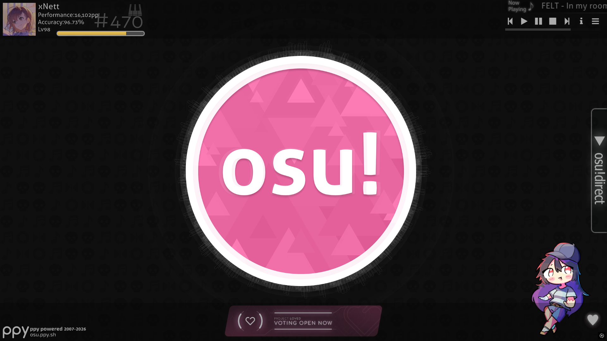
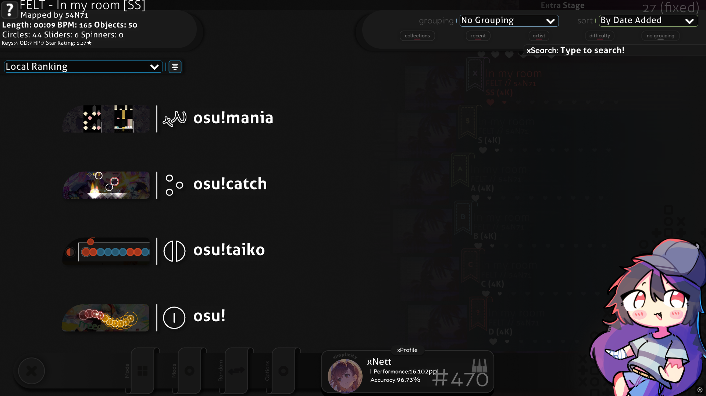
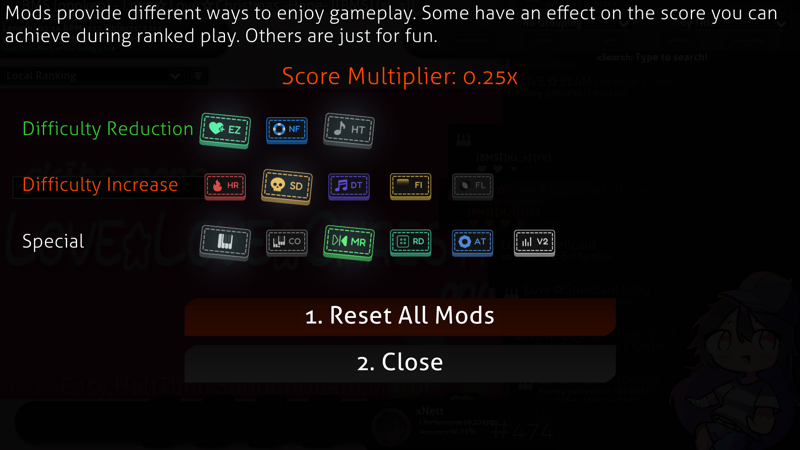

# ximplicity by xNett

An all-in-one osu! skin that covers every single game mode. The goal was to make something that looks great (I hope!) and stays perfectly legible for both new and experienced players.

## Screenshots

Menu

  

Gameplay

  

## Supported Modes
All of them! :)

## Installation
1. Download the `.osk` file from the **Releases** section.
2. In osu!, go to **Options** > **Select Skin** > choose **"Ximplicity"**.
3. Restart osu! if it doesn't appear immediately.

## Compatibility
- **osu! Version**: Stable (gameplay should work perfectly on Lazer too)
- **Recommended Resolution**: 1920x1080 (16:9 FHD) or 1280x720 (16:9 HD)

## Customization
Want to personalize this skin? You can easily customize osu!mania hit positions and note colors, as well as for the other game modes by editing the provided `.AI` files. All source files for all modes are included in the G-Drive link. Feel free to modify them to match your preferences and create your own unique version!

## Changelog
- **v1.0.0** — Initial release

## How to Contribute
1. Report bugs in **Issues**.
2. For patches or improvements, open a **Pull Request** with a description and screenshots.

## Contact & Support
For issues, suggestions, or feedback, please open an issue in this repository... or feel free to DM me on osu!

## Credits
- **Menu Character Illustration**: [KouriHase](https://x.com/Kourihase)

------------------------------------------------

**Created by xNett** • Free to use and modify for personal use. Please provide credit if adapting these assets for public skin mixes.
